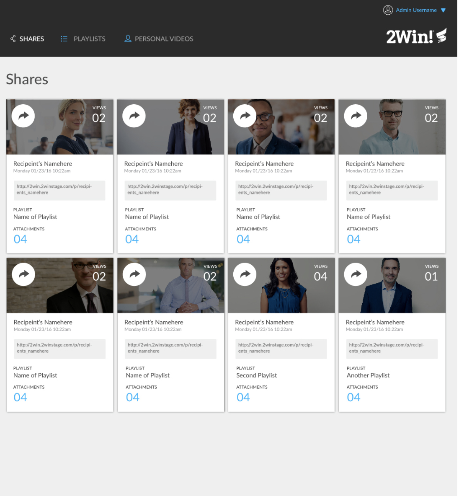
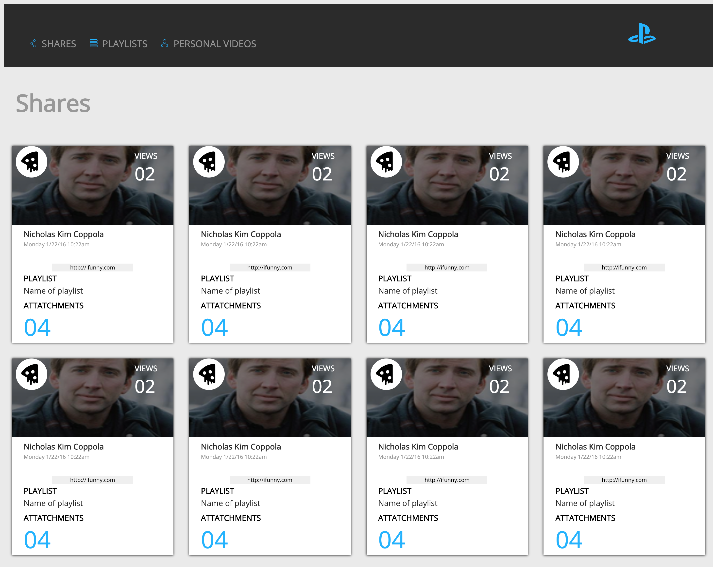
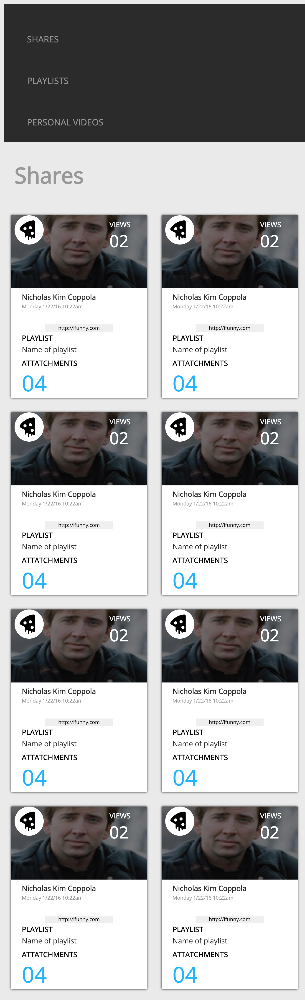
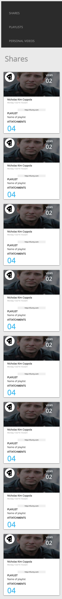

# Static Comp 1 

## Bio of the project

This is the first official static comp that turing gave us to recreate. They did not give us any of the assets or color guide. We had complete freedom except it had to match the card UI style.

### This is the comp that they provided

They wanted us to utilize flex-box but NOT grid on this project.

### This is my desktop page that I created

I didn't have any inspiration for each of the cards so I just made the picture Nicholas Cage from the site PlaceCage. 

#### This is the tablet and bigger phone page 

##### This is the page that is displayed on mobile devices 

